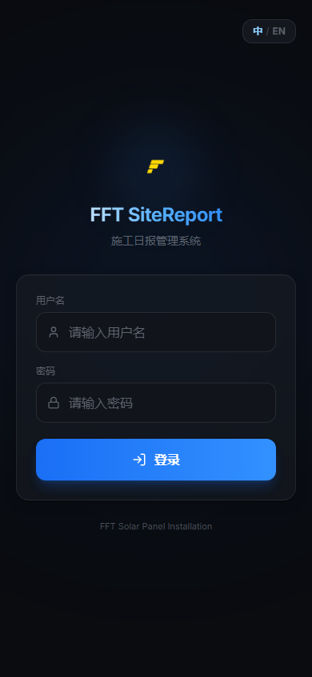
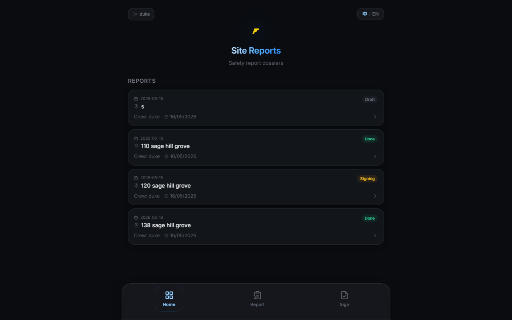
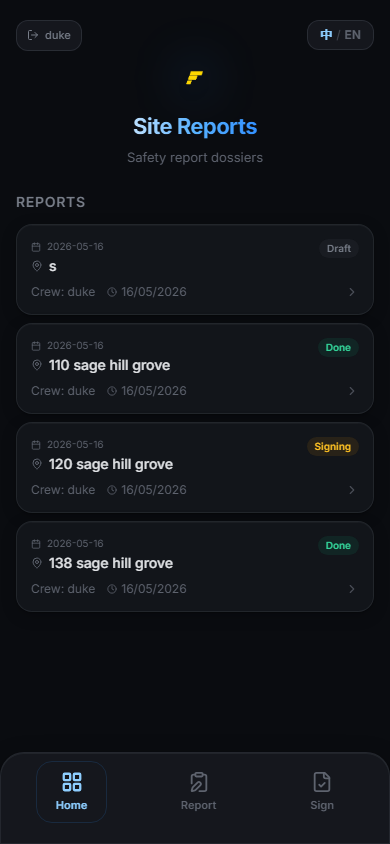
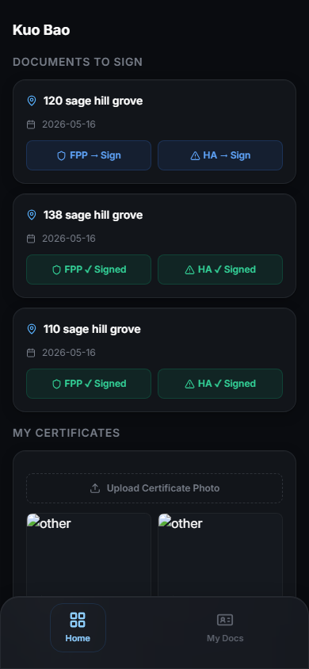
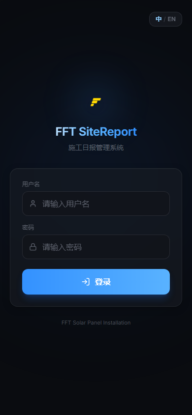

<p align="center">
  <picture>
    <source media="(prefers-color-scheme: dark)" srcset="./assets/01-login.png">
    
  </picture>
</p>

<h1 align="center">FFT SiteReport</h1>

<p align="center">
  <strong>Digital Safety Workflow for Solar Installation Teams</strong>
</p>

<p align="center">
  Replace paper-based Fall Protection Plans and Hazard Assessments with a streamlined digital signing experience — from the field, in real time.
</p>

<p align="center">
  
  
  
  
</p>

---

## Why FFT SiteReport?

Solar panel installation involves work at height, electrical hazards, and dynamic job sites. Every site requires a **Fall Protection Plan (FPP)** and **Hazard Assessment (HA)** signed by every worker before work begins. Paper forms are slow, illegible, and impossible to track across multiple crews.

FFT SiteReport replaces that paper stack with a **6-step digital wizard** that handles the entire safety workflow:

- Crew lead fills out FPP & HA on their phone or tablet
- Workers receive a push notification and sign with their finger
- Signatures are captured as tamper-proof HTML snapshots
- Everything is stored, searchable, and exportable

---

## Screenshots

<p align="center">
  
  <br/>
  <sub><i>Crew Lead dashboard — report overview, pending documents, and quick actions</i></sub>
</p>

<div align="center">
  <table>
    <tr>
      <td></td>
      <td></td>
      <td></td>
    </tr>
    <tr>
      <td align="center"><sub>Crew Lead · Mobile</sub></td>
      <td align="center"><sub>Worker · Sign-off Queue</sub></td>
      <td align="center"><sub>Admin · System Overview</sub></td>
    </tr>
  </table>
</div>

---

## Core Features

<table>
<tr>
<td width="50%">

###  Site Report Wizard
6-step guided flow to create a complete safety package:

1. **Site Media** — Record a site walkthrough video (optional)
2. **Basic Info** — Work address, date, employer, panel quantity
3. **Crew** — Select workers, assign crew lead, view cert status
4. **FPP** — Fall Protection Plan with clearance auto-calculation
5. **HA** — Hazard Assessment with dynamic hazard entries
6. **Sign-off** — Send to all workers for e-signature

</td>
<td width="50%">

###  Electronic Signature
- Hand-drawn signature capture on HTML5 Canvas
- Auto-generated tamper-proof document snapshots
- Real-time signing progress tracking per worker
- Both FPP and HA require independent signatures
- Crew lead can also sign documents from the Sign tab

</td>
</tr>
<tr>
<td width="50%">

###  Employee & Certificate Management
- Employee CRUD with role-based access (worker / crew_lead)
- Certificate tracking: Fall Protection, First Aid, Electrical, Driver's License
- Certificate image upload and expiry date monitoring
- Active/inactive status toggling

</td>
<td width="50%">

###  AI-Assisted Workflow
- **Voice → Text**: Groq Whisper API transcribes audio notes
- **Text Summarization**: DeepSeek AI summarizes field observations
- **Telegram Notifications**: Bot alerts when reports are completed
- All AI features are optional and configurable via `.env`

</td>
</tr>
<tr>
<td width="50%">

###  NAS File Storage
- Upload site videos to Synology NAS via FileStation API
- Automatic directory structuring by date
- Configurable timeout and SSL settings
- Falls back gracefully if NAS is unavailable

</td>
<td width="50%">

###  Clearance Auto-Calc
- FPP Clearance Requirements: F(total) = a + b + c + d + e
- Auto-calculated in real time as each value is entered
- Prevents arithmetic errors on critical safety measurements

</td>
</tr>
</table>

---

## Tech Stack

| Layer | Technology |
|-------|------------|
| **Frontend** | React 18 · TypeScript · Vite 6 · TailwindCSS · Framer Motion · React Router v6 |
| **Backend** | FastAPI (Python 3.11) · SQLAlchemy 2.0 (async) · Pydantic v2 · bcrypt |
| **Database** | PostgreSQL 16 (Alpine) |
| **AI/ML** | Groq Whisper (STT) · DeepSeek (Summarization) |
| **Storage** | Synology NAS (FileStation API) · Docker Volumes |
| **Notifications** | Telegram Bot API |
| **Infrastructure** | Docker Compose · Nginx (Alpine) · Uvicorn |

---

## Architecture

```
┌─────────────────────────────────────────────────────┐
│                    NGINX :6010                       │
│         SPA static files  │  /api/* → backend:8000  │
└──────────────────────────┬──────────────────────────┘
                           │
┌──────────────────────────▼──────────────────────────┐
│                  FASTAPI :6011                        │
│  ┌──────────┐ ┌──────────┐ ┌──────────────────────┐ │
│  │ Auth     │ │ Reports  │ │ Signatures           │ │
│  │ (Bearer) │ │ FPP / HA │ │ (Canvas → Base64)    │ │
│  ├──────────┤ ├──────────┤ ├──────────────────────┤ │
│  │ Workers  │ │ Employees│ │ Certificates         │ │
│  │ (Clock)  │ │ (CRUD)   │ │ (Expiry Tracking)    │ │
│  ├──────────┤ ├──────────┤ ├──────────────────────┤ │
│  │ Voice STT│ │ Telegram │ │ NAS Upload           │ │
│  │ (Groq)   │ │ (Bot)    │ │ (Synology)           │ │
│  └──────────┘ └──────────┘ └──────────────────────┘ │
└──────────────────────────┬──────────────────────────┘
                           │
┌──────────────────────────▼──────────────────────────┐
│               POSTGRESQL :6012                        │
│  employees · site_reports · fpp · ha · signatures    │
│  certificates · document_snapshots · media_files     │
└─────────────────────────────────────────────────────┘
```

---

## Report Lifecycle

```
DRAFT ──→ READY_FOR_SIGNATURE ──→ PENDING_SIGNATURES ──→ COMPLETED
   ↑            ↑                         ↑                    ↑
   │     Crew lead confirms        Workers begin           All workers
   │     FPP + HA filled           signing one by one      have signed
   │
 Report created,
 FPP/HA being
 filled out
```

---

## Quick Start

### Prerequisites

- Docker & Docker Compose
- Git

### 1. Clone & Configure

```bash
git clone https://github.com/bkcsplayer/fft-sitereport.git
cd fft-sitereport

# Copy and edit environment variables
cp .env.example .env
# Edit .env — set ADMIN_PASSWORD and optionally API keys
```

### 2. Start

```bash
docker compose up -d --build
```

### 3. Open

| Service | URL |
|----------|-----|
| Frontend | http://localhost:6010 |
| Backend API | http://localhost:6011/docs |
| Database | localhost:6012 |

### 4. Login

| Username | Password | Role |
|----------|----------|------|
| `admin` | (from `.env`) | Administrator |
| `duke` | `123456` | Crew Lead |
| `cool` | `123456` | Worker |

> Create additional workers and crew leads from the Admin → Employees panel.

---

## API Overview

All endpoints under `/api`. Full Swagger docs at `/docs` when backend is running.

| Module | Key Endpoints |
|--------|--------------|
| **Auth** | `POST /api/auth/login` · `POST /api/auth/logout` |
| **Site Reports** | `POST /api/site-reports` · `GET /api/site-reports/{id}` · `POST /api/site-reports/{id}/confirm` |
| **FPP** | `POST /api/site-reports/{id}/fpp` · `GET /api/site-reports/{id}/fpp` |
| **HA** | `POST /api/site-reports/{id}/ha` · `GET /api/site-reports/{id}/ha` |
| **Signatures** | `POST /api/signatures` · `GET /api/signatures/progress/{report_id}` |
| **Workers** | `GET /api/worker/dashboard` · `GET /api/worker/site-report/{id}/documents` |
| **Employees** | `GET /api/employees` · `POST /api/employees` · `PATCH /api/employees/{id}` |
| **Certificates** | `POST /api/certificates/employees/{eid}/certificates` |
| **Media** | `POST /api/site-reports/{id}/videos` · `POST /api/site-reports/{id}/audio` |

---

## Configuration

All settings via `.env`:

| Variable | Required | Description |
|----------|:--------:|-------------|
| `ADMIN_USERNAME` / `ADMIN_PASSWORD` | Yes | Admin login credentials |
| `DATABASE_URL` | Yes | PostgreSQL connection string |
| `GROQ_API_KEY` | No | Groq Whisper for voice transcription |
| `DEEPSEEK_API_KEY` | No | DeepSeek for text summarization |
| `TELEGRAM_BOT_TOKEN` / `TELEGRAM_CHAT_ID` | No | Telegram notifications |
| `NAS_URL` / `NAS_USERNAME` / `NAS_PASSWORD` | No | Synology NAS file upload |

---

## Local Development (without Docker)

```bash
# Backend
cd backend
pip install -r requirements.txt
uvicorn app.main:app --reload --port 6011

# Frontend
cd frontend
npm install
npm run dev -- --port 6010
```

The Vite dev server proxies `/api` requests to `http://localhost:6011`.

---

## Project Structure

```
fft-sitereport/
├── backend/
│   ├── app/
│   │   ├── models/          # SQLAlchemy ORM models (6 domain files)
│   │   ├── schemas/         # Pydantic request/response schemas
│   │   ├── routers/         # FastAPI route handlers (12 files)
│   │   ├── services/        # Business logic (AI, NAS, Telegram)
│   │   ├── main.py          # App entry point, route registration
│   │   ├── config.py        # Pydantic Settings from .env
│   │   └── database.py      # Async engine + session factory
│   └── requirements.txt
├── frontend/
│   ├── src/
│   │   ├── pages/           # 13 page components
│   │   ├── components/      # 7 reusable components
│   │   ├── services/api.ts  # API client + TypeScript types
│   │   ├── auth.tsx         # Auth context provider
│   │   └── i18n.tsx         # zh/en internationalization
│   └── nginx.conf
├── docker-compose.yml
├── .env.example
└── assets/                  # README screenshots
```

---

## License

MIT © FFT Solar

---

<p align="center">
  <sub>Built for field safety. Designed for speed. Trusted by crews.</sub>
</p>
